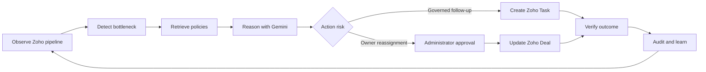
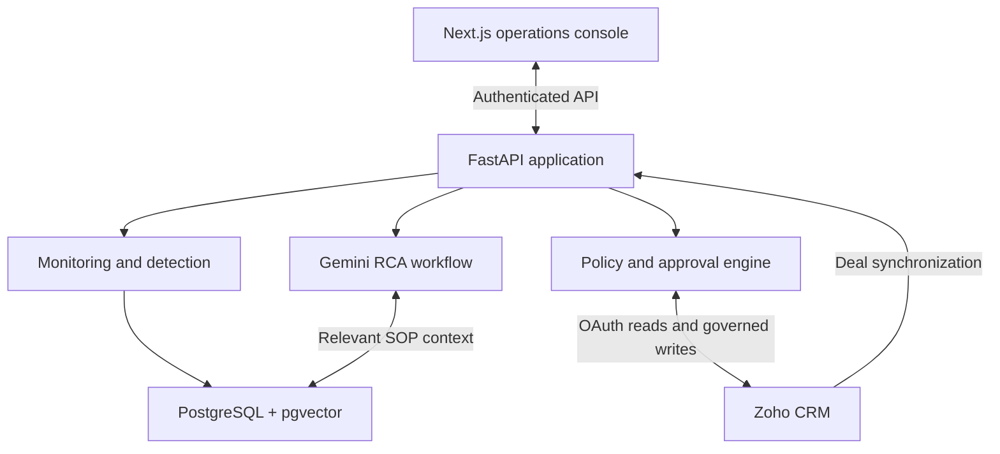

# Velocity CRM Agent

### From pipeline signals to governed action

[](https://nextjs.org/)
[](https://fastapi.tiangolo.com/)
[](https://www.postgresql.org/)
[](https://www.zoho.com/crm/)

**Velocity** is an AI-assisted CRM operations agent that continuously watches a sales pipeline, detects operational bottlenecks, explains likely root causes, and turns recommendations into controlled actions in Zoho CRM.

It is designed around a simple principle: **AI may recommend, but policy decides what can execute.** Low-risk follow-ups can become governed Zoho Tasks, while high-impact owner changes remain behind explicit administrator approval. Every decision and action leaves an auditable trail.

**[Open the live application](https://velocity-crm.onrender.com)** · **[Backend API](https://velocity-agentic-ai.onrender.com)**

> The public deployment may take a short moment to wake from an idle state. Access to operational data requires authentication.

## The Problem

CRM teams rarely lose momentum because they lack data. They lose it because the warning signs are scattered: a deal sits untouched, one owner accumulates too much work, a follow-up is missed, or an approval quietly becomes the critical path.

Traditional dashboards show what already happened. Velocity closes the gap between **seeing a bottleneck**, **understanding why it exists**, and **resolving it safely**.

## What Velocity Does

| Capability | Product behavior |
| --- | --- |
| **Proactive monitoring** | Runs configurable pipeline scans and records each monitoring run. |
| **Deterministic detection** | Identifies stalled deals and overloaded owners from explainable thresholds and live CRM evidence. |
| **AI root-cause analysis** | Uses Gemini to produce structured analysis grounded in incident facts and retrieved operating policies. |
| **Knowledge grounding** | Retrieves relevant SOP and policy passages from a pgvector-backed operational knowledge base. |
| **Governed follow-ups** | Creates Zoho Tasks only when the action is permitted and the target deal is synchronized. |
| **Approval-gated reassignment** | Requires an administrator decision before changing a deal owner in Zoho. |
| **Closed-loop outcomes** | Verifies whether an intervention cleared the bottleneck and records the result. |
| **Auditability** | Presents human-readable incident history with actor, source, status, time, and correlation evidence. |

## Why It Is Agentic

Velocity owns a complete operational loop rather than stopping at chat or summarization:



Detection remains deterministic and inspectable. Gemini is used where semantic reasoning adds value: explaining evidence, connecting it to policy, and recommending a constrained action. Provider writes are performed only by validated application tools.

## Built for Trust

- **Human in the loop:** owner reassignment cannot bypass administrator review.
- **Least-privilege OAuth:** readiness is evaluated separately for Deal reads, Task creation, Deal updates, and active-user resolution.
- **Encrypted provider tokens:** Zoho OAuth tokens are encrypted at rest and never returned to the client.
- **Evidence-grounded AI:** incident data and retrieved policy references constrain structured Gemini output.
- **Idempotent actions:** repeated requests reuse active work instead of silently duplicating tasks or approvals.
- **Explicit provider state:** the UI distinguishes local fallback, connection, synchronization, permissions, and actual write readiness.
- **Protected operations:** authenticated APIs and role checks guard sensitive workflows.

## Architecture



| Layer | Technology |
| --- | --- |
| Experience | Next.js 16, React 19, TypeScript, Tailwind CSS, Radix UI |
| Application API | FastAPI, SQLAlchemy async, Pydantic |
| Intelligence | Google Gemini, structured output, retrieval-augmented policy context |
| Data | PostgreSQL 17, pgvector, Alembic |
| CRM integration | Zoho CRM OAuth 2.0 and REST APIs |
| Production | Render web services and managed PostgreSQL |

## Jury Demo

A focused walkthrough takes five steps:

1. **Start at the dashboard** to inspect pipeline health, active incidents, owner capacity, and the latest monitoring evidence.
2. **Open an incident** to review its risk score, concrete evidence, and chronological audit history.
3. **Run root-cause analysis** to see Gemini connect CRM facts with relevant operating policy.
4. **Execute the recommendation:** create a governed follow-up, or submit reassignment for administrator review.
5. **Close the loop** by approving the high-impact action where applicable and verifying the recorded outcome.

The Zoho integration screen independently proves connection, Deal synchronization, active adapter, and each permission required for provider execution. This avoids presenting a read-only connection as automation-ready.

## Local Development

### Prerequisites

- Node.js 20+
- Python 3.12+
- PostgreSQL 17 with the pgvector extension
- Zoho and Gemini credentials only for their respective integrations

### Backend

```powershell
cd backend
python -m venv .venv
& .\.venv\Scripts\Activate.ps1
pip install -r requirements.txt
python -m alembic upgrade head
uvicorn app.main:app --reload
```

Create `backend/.env` from your own environment configuration. Never commit OAuth credentials, API keys, token-encryption keys, or database URLs. See [backend/README.md](backend/README.md) for service configuration and integration details.

### Frontend

```powershell
cd frontend
npm install
npm run dev
```

Configure the frontend API origin for your backend, then open `http://localhost:3000`. See [frontend/README.md](frontend/README.md) for frontend commands.

## Validation

The project is covered by backend regression tests plus frontend lint and production-build checks. The implemented test surface includes authentication, detection, monitoring, RCA guardrails, knowledge retrieval, follow-up idempotency, reassignment approvals, outcome verification, Zoho OAuth, Deal synchronization, and provider adapter contracts.

```powershell
cd backend
pytest

cd ..\frontend
npm run lint
npm run build
```

## Product Direction

Velocity’s current production slice proves the full operational loop on Zoho CRM: observe, detect, reason, approve, act, and verify. The next production-hardening priorities are secure HttpOnly sessions, tenant-level object authorization, KMS-backed token encryption, transactional outbox reconciliation for external writes, and distributed monitoring coordination.

---

Built to make CRM automation faster without making it reckless.